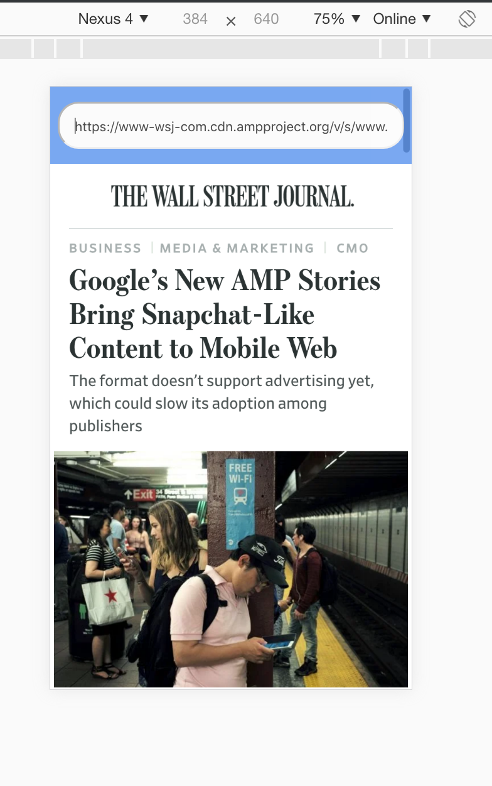

# amp-viewer

Copied and tweak example amp-viewer from the amp project: https://github.com/ampproject/amphtml.

So you can view your amp page before deploy it to production.

The amp viewer will contain all the css style hacks that you would expect from the actual amp-viewer from google search results.

